# Route Posts

A modern social media platform built with Next.js 16, React 19, and Tailwind CSS v4. Features real-time notifications, user profiles, posts, comments, likes, bookmarks, and friend suggestions.

## 🚀 Tech Stack

| Layer | Technology |
|---|---|
| **Framework** | Next.js 16 (App Router) |
| **Language** | TypeScript 5 |
| **Styling** | Tailwind CSS v4 |
| **State** | Zustand + TanStack Query (planned) |
| **Auth** | Better Auth (planned) |
| **Real-time** | Socket.IO (dev) → Polling (Vercel) |
| **Icons** | Lucide React |
| **Animations** | Framer Motion |
| **Validation** | Joi |
| **Testing** | Playwright (E2E) |

## ✨ Features

- **Authentication** — Sign up / Sign in with email & password (JWT)
- **Feed** — Timeline with posts from followed users
- **Posts** — Create, like, comment, share, bookmark, delete
- **Comments** — Nested replies, likes, real-time updates
- **Notifications** — Live unread count, notification center (polling-based for Vercel)
- **Profiles** — User profiles with cover photos, stats, posts, saved posts
- **Profile Visit** — View other users' profiles with follow/unfollow
- **Suggested Friends** — Search & follow with debounced API calls
- **Bookmarks** — Save/unsave posts
- **Dark/Light Mode** — Persisted in localStorage, no flash
- **Responsive** — Mobile-first, works on all screen sizes

## 📸 Screenshots

### Light Mode

| Home Feed (Guest) | Home Feed (Logged In) | Sign In | Sign Up |
|:---:|:---:|:---:|:---:|
| 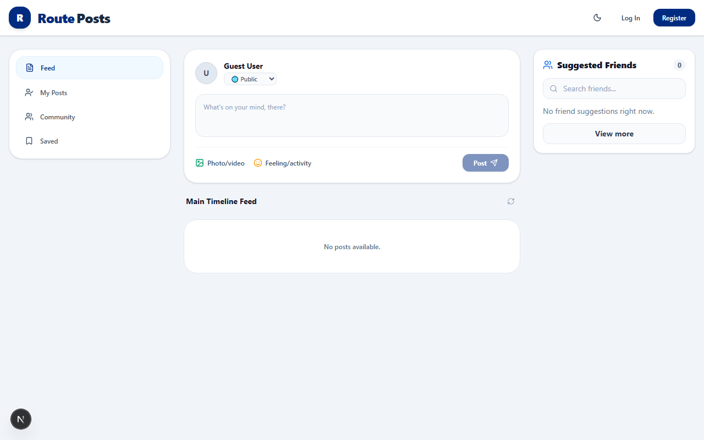 |  | 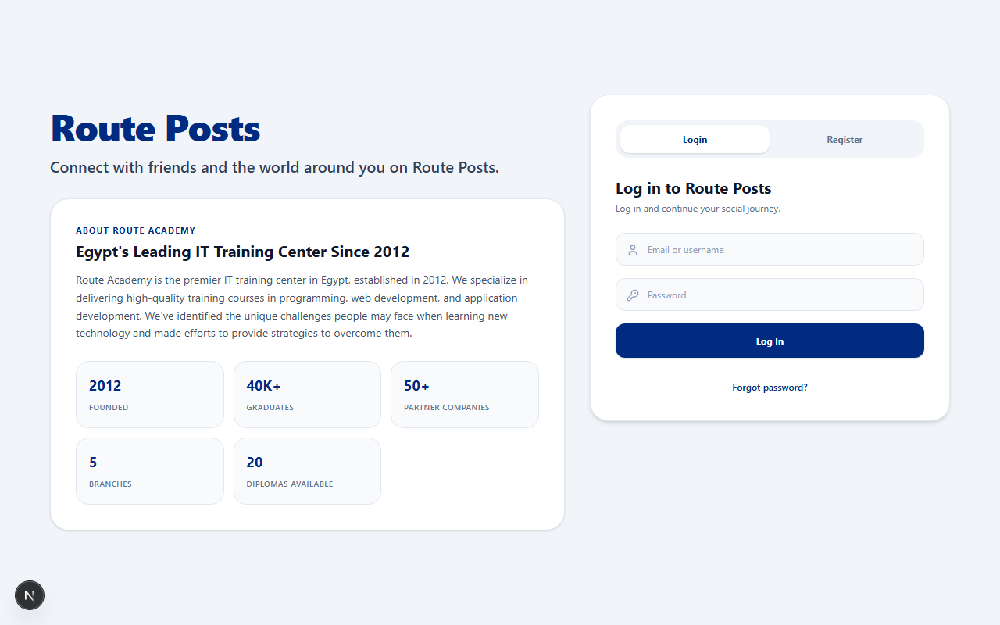 |  |

| Profile | Notifications | Suggestions | Post Detail |
|:---:|:---:|:---:|:---:|
| 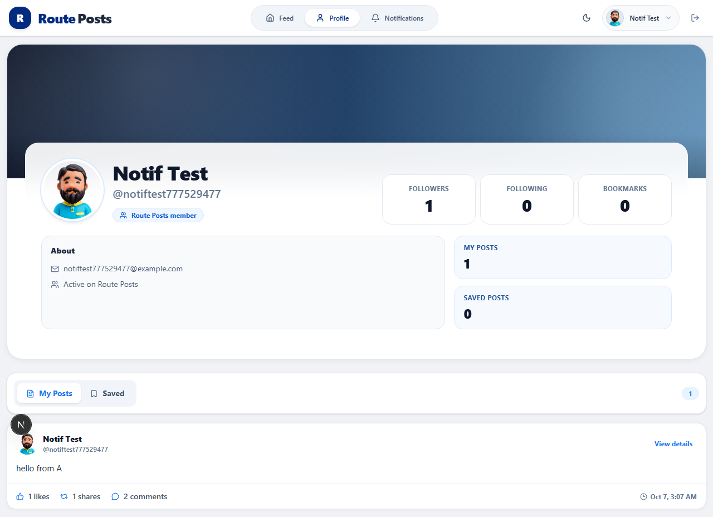 | 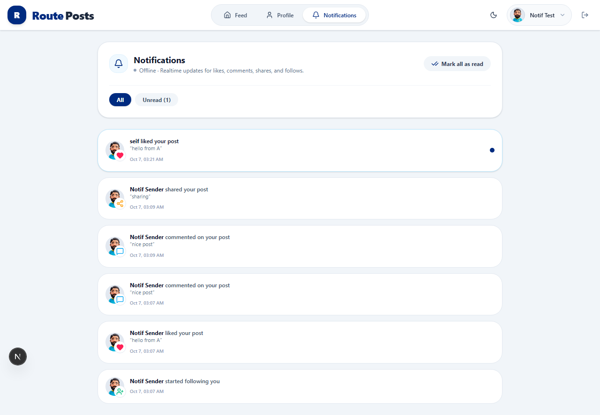 | 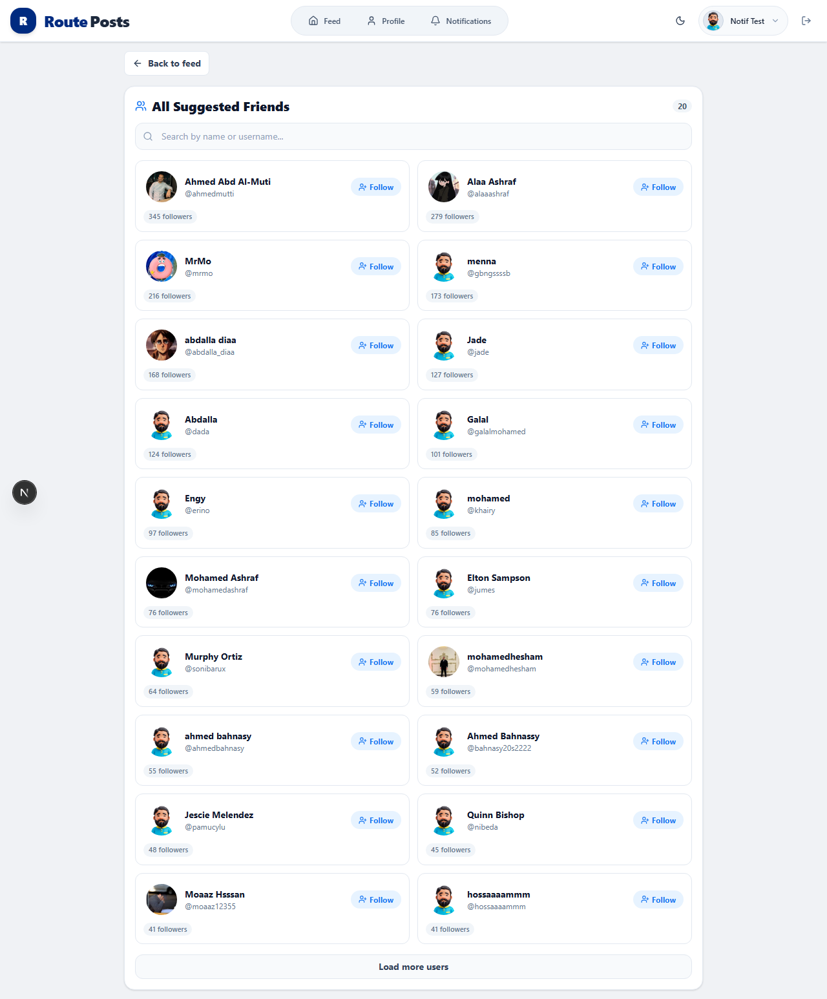 | 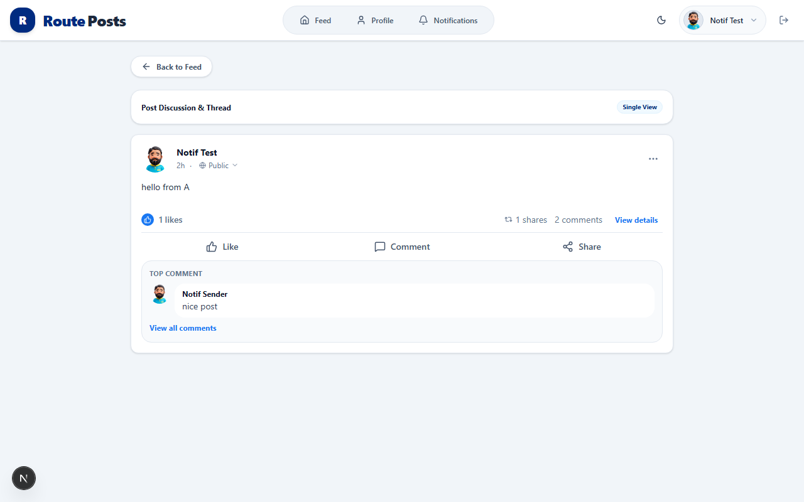 |

### Dark Mode

| Home Feed | Sign In | Profile |
|:---:|:---:|:---:|
|  | 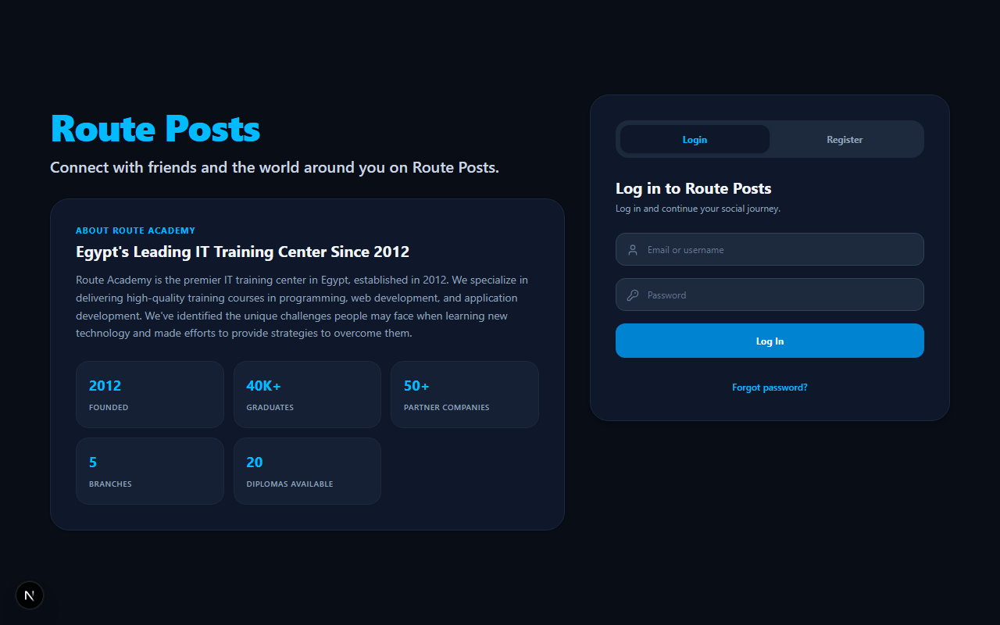 | 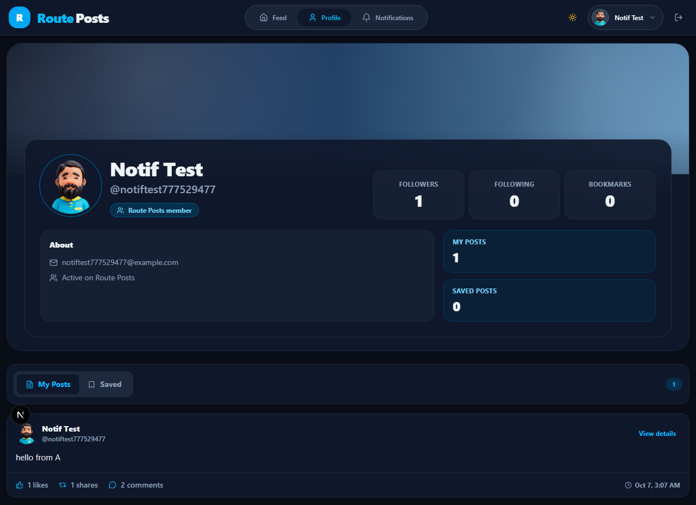 |

| Notifications | Suggestions | Post Detail |
|:---:|:---:|:---:|
| 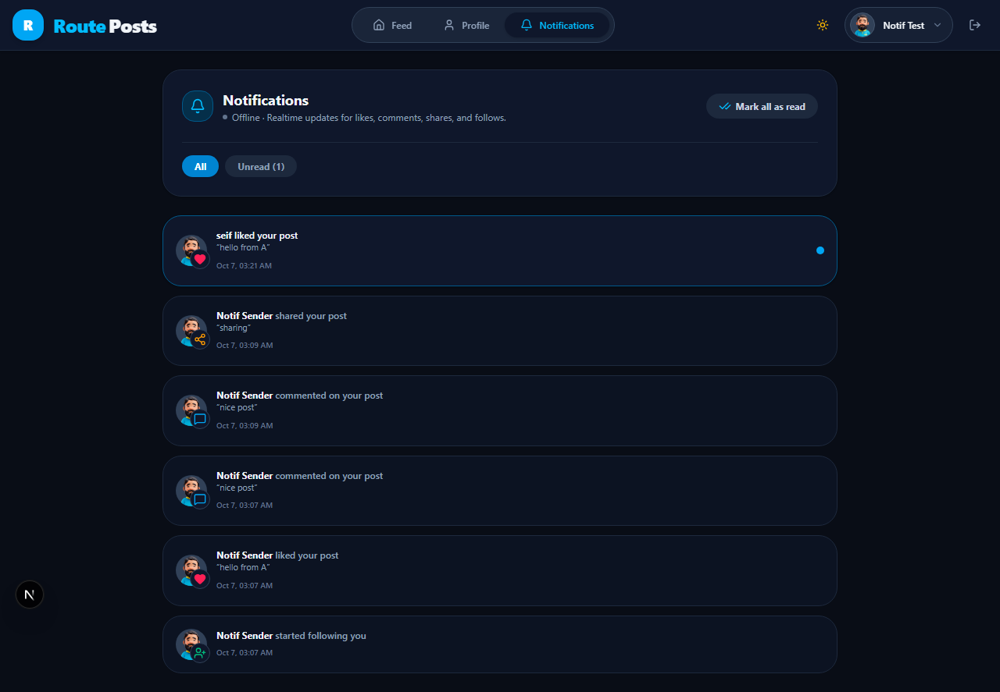 | 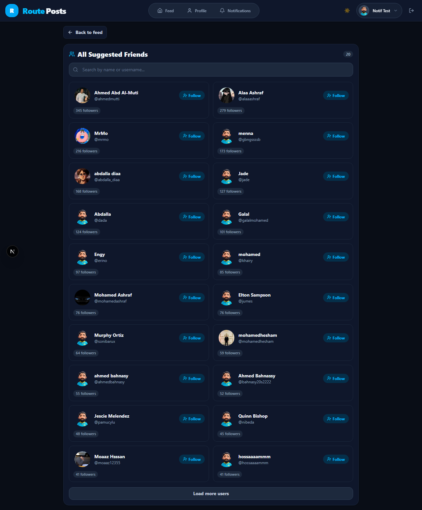 | 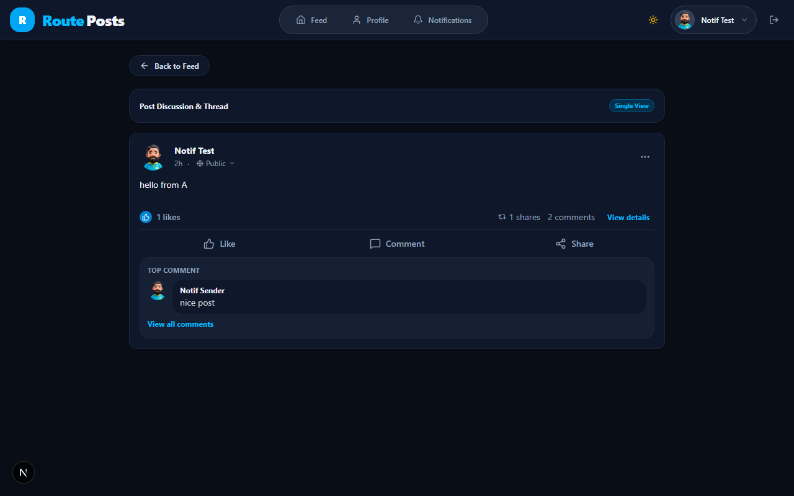 |

## 🛠 Getting Started

### Prerequisites

- Node.js 20+
- npm 10+

### Installation

```bash
# Clone the repository
git clone https://github.com/yourusername/route-posts.git
cd route-posts

# Install dependencies
npm install

# Start development server
npm run dev
```

Open [http://localhost:3000](http://localhost:3000) in your browser.

### Environment Variables

Create a `.env.local` file:

```env
# Route Posts API
NEXT_PUBLIC_API_URL=https://route-posts.routemisr.com

# Better Auth (when implemented)
BETTER_AUTH_SECRET=your-secret-key
BETTER_AUTH_URL=http://localhost:3000
```

## 📁 Project Structure

```
src/
├── app/                    # Next.js App Router pages
│   ├── api/               # API routes (Better Auth will generate /api/auth/*)
│   ├── auth/              # Sign in / Sign up pages
│   ├── bookmarks/         # Bookmarked posts
│   ├── notifications/     # Notification center
│   ├── posts/             # Post detail pages
│   ├── profile/           # My profile & visit profile/[userId]
│   ├── suggestions/       # All suggested friends page
│   ├── layout.tsx         # Root layout + providers
│   ├── page.tsx           # Home feed
│   └── not-found.tsx      # 404 page
├── components/            # React components
│   ├── Header.tsx         # Navigation + auth state
│   ├── PostCard.tsx       # Post display + interactions
│   ├── SuggestedFriends.tsx # Friend suggestions widget
│   ├── ConfirmDialog.tsx  # Reusable confirmation modal
│   └── ...
├── hooks/                 # Custom React hooks
│   └── useNotificationSocket.ts # Polling-based notifications
├── lib/                   # Utilities & API
│   ├── api.ts             # API client with interceptors
│   ├── auth.ts            # Better Auth config (planned)
│   ├── queryClient.ts     # TanStack Query client (planned)
│   ├── queryKeys.ts       # Query key factory (planned)
│   ├── social.ts          # Shared social utilities
│   └── socket.ts          # Socket.IO client (dev only)
├── store/                 # Zustand stores
│   ├── authStore.ts       # Auth state (to be replaced by Better Auth)
│   ├── notificationStore.ts # Notification UI state
│   └── themeStore.ts      # Dark/light mode
├── types/                 # TypeScript types
│   └── api.ts             # API response types
└── styles/
    └── globals.css        # Tailwind v4 + CSS variables
```

## 🔮 Roadmap (Migration Plan)

See [docs/TANSTACK_QUERY_BETTER_AUTH_MIGRATION_PLAN.md](docs/TANSTACK_QUERY_BETTER_AUTH_MIGRATION_PLAN.md)

| Phase | Focus | Status |
|---|---|---|
| 1 | TanStack Query (caching, deduping, optimistic updates) | 📋 Planned |
| 2 | Better Auth (credentials, JWT, HttpOnly cookies) | 📋 Planned |
| 3 | Cookie-based token flow + polling notifications | 📋 Planned |
| 4 | Cleanup (remove Zustand authStore, add next-themes) | 📋 Planned |

## 🧪 Testing

```bash
# Type checking
npm run lint          # ESLint
npm run build         # TypeScript + Next.js build

# E2E tests (Playwright)
npx playwright test tests/e2e/

# API tests (manual)
node tests/api/test_api.js
```

## 📦 Deployment

### Vercel (Recommended)

1. Push to GitHub
2. Import in Vercel
3. Add environment variables
4. Deploy

> **Note**: The app uses standard `next start` — no custom server. Real-time notifications use polling (15-30s interval) for Vercel compatibility.

### Other Platforms

Any platform supporting Node.js 20+:
- Render
- Railway
- Fly.io
- AWS Amplify
- Docker

## 🤝 Contributing

1. Fork the repository
2. Create a feature branch (`git checkout -b feat/amazing-feature`)
3. Commit changes (`git commit -m 'feat: add amazing feature'`)
4. Push to branch (`git push origin feat/amazing-feature`)
5. Open a Pull Request

## 📄 License

MIT License — see [LICENSE](LICENSE) for details.

## 🙏 Acknowledgments

- [Route Posts API](https://route-posts.routemisr.com) by Route Academy
- [Next.js](https://nextjs.org)
- [Tailwind CSS](https://tailwindcss.com)
- [Better Auth](https://better-auth.com)
- [TanStack Query](https://tanstack.com/query)
- [Lucide Icons](https://lucide.dev)
- [Framer Motion](https://framer.com/motion)